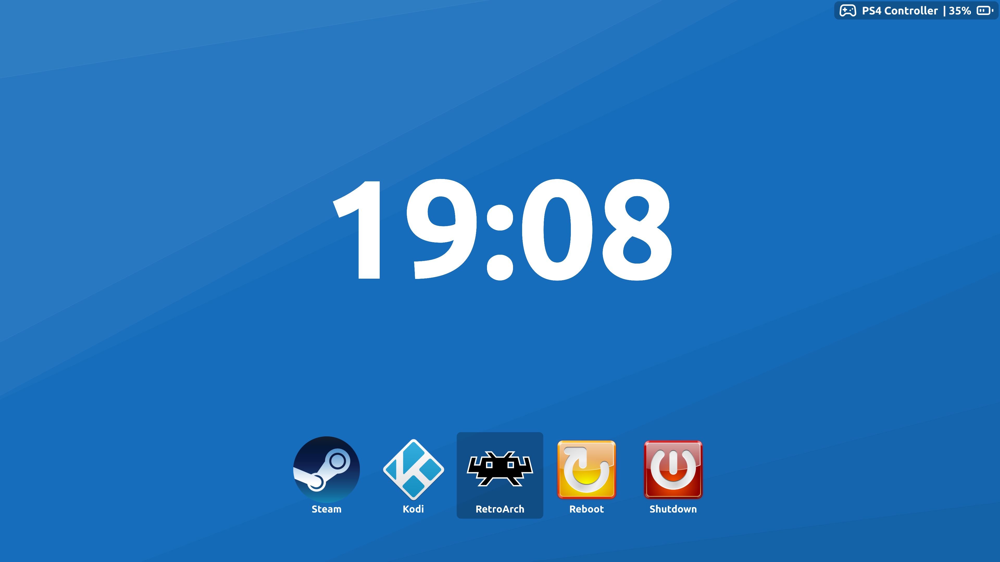

# GamePad Controlled Launcher

This is a simple application launcher designed to be a home screen for my home media center.
It displays a list of connected gamepads, a clock and a row of applications to run.

The launcher is designed to respect gamepad inputs:
d-pad buttons work as arrow keys and the bottom action button works as enter.

Lucide icons are used for gamepad status indication.



*Now the project is on the early development stage*

## Build

The launcher is written in Rust, so it is built with `cargo`.

It uses `Slint` as a graphical toolkit and uses `winit` as a backend
(required for checking window focus).

Now project is configured to work only in wayland environment,
but it can be easily changed for X11 support.
For details see the [slint feature list](https://docs.rs/slint/1.1.1/slint/#feature-flags).

## Configure

The config file should be placed at `$XDG_CONFIG_HOME/gcpl.toml`.

Example:
```toml
[layout]
top_panel_height = 40
clock_height = 200
icon_size = 256

[[items]]
name = "Steam"
icon = "/usr/share/icons/hicolor/256x256/apps/steam.png"
exec = "steam -gamepadui"

[[items]]
name = "Kodi"
icon = "/usr/share/icons/hicolor/256x256/apps/kodi.png"
exec = "kodi"
```

The layout configuration itself and layout parameters are optional.
Note that layout parameters are defined in _logical_ pixels.